I) Установить и настроить iSCSI Target из пакета istgt на машине для второго практического занятия, создать и экспортировать 2 LUN по 512 МБ с доступом с паролем для пользователя c паролем из лабораторной работы №1
Для определения размещения устройств разделить номер бригады на 2 и найти остаток от деления:
		0 – RAM (в оперативной памяти, tmpfs)
		1 – block (на блочном устройстве, LVM)
		2 – file (в файле)
	При нехватке ресурсов  – запросить увеличение у преподавателя (память:  cat /proc/memory, блочные устройства: lslbk, место на дисках: df  -h)

1) Установка пакета tgt

``` sudo apt install tgt -y ```


2) Проверим статус сервиса

``` sudo systemctl status tgt ```

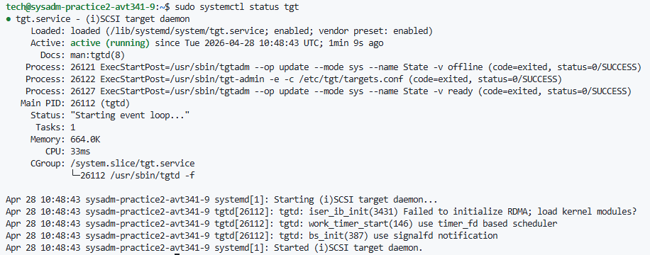

3) Создание первого LUN (512 МБ)
``` sudo lvcreate -L 512M -n iscsi_lun0 ubuntu-vg ```

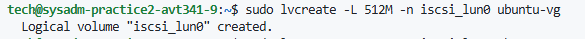

4) Создание второго LUN (512 МБ)
``` sudo lvcreate -L 512M -n iscsi_lun1 ubuntu-vg ```

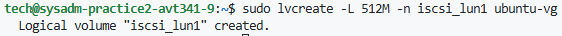

5) Проверим созданые LUN
``` sudo lvdisplay | grep -E "LV Name|LV Size" ```

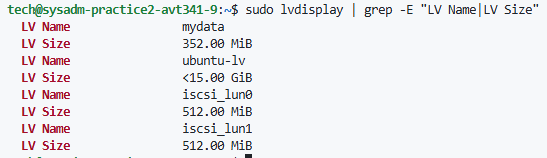

6) Настройка Target и LUN. Редактируем файл конфигурации. В Ubuntu 22.04 tgt использует include директиву. Создадим отдельный файл для нашего target: 

``` sudo vi /etc/tgt/conf.d/iscsi-lab3.conf ```

Конфигурация:

```
# /etc/tgt/conf.d/iscsi-lab3.conf
<target iqn.2026-04.local.lab:storage.target1>
    incominguser root rebustubus
    initiator-address 172.16.8.149
    backing-store /dev/ubuntu-vg/iscsi_lun0
    backing-store /dev/ubuntu-vg/iscsi_lun1
</target>

```

7) Перезапустим службы для чтения конфигурации
``` sudo systemctl restart tgt ```

8) Проверим, что target активен
``` sudo systemctl status tgt ```

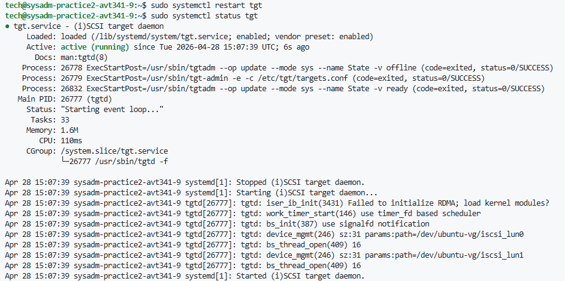

9) Просмотрим таргеты
``` tgtadm --mode target --op show ```

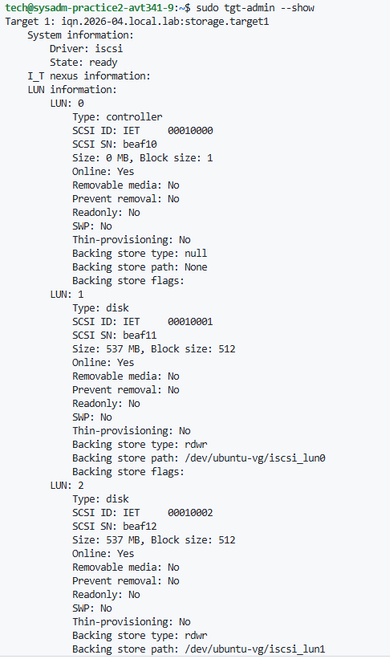

II) Настроить firewall для удаленного доступа к iSCSI Target на данной машине по сети.

# Выполняется на машине второй практики

1) Разрешаем iSCSI трафик с IP-адреса первой практики
``` 
sudo ufw allow from 172.16.8.149 to any port 3260 proto tcp comment 'iSCSI Target for Lab1' 
sudo ufw allow ssh
```

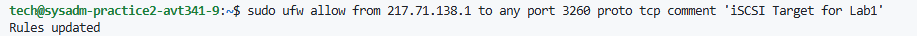

2) Включаем firewall on system starup

``` sudo ufw enable ```

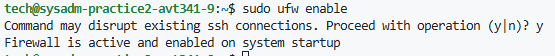

3) Проверяем правила
``` sudo ufw status numbered ``` 

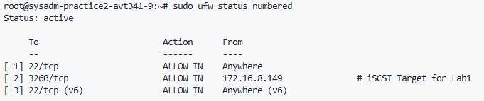

# Выполняется на машине первой практики

4) Установи iscsci на CentOS:

``` sudo yum install iscsi-initiator-utils -y ```

5) Запустим сервис iscsid

``` sudo service iscsid start ```

6) Включим автозагрузку сервиса

``` sudo chkconfig iscsid on ```

7) Проведём discovery в iscid:

``` iscsiadm -m discovery -t st -p 172.16.8.169 ```

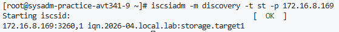

8) Проведём login к targetу:

```
iscsiadm -m node -T iqn.2026-04.local.lab:storage.target1 -o update -n node.session.auth.authmethod -v CHAP
iscsiadm -m node -T iqn.2026-04.local.lab:storage.target1 -o update -n node.session.auth.username -v root
iscsiadm -m node -T iqn.2026-04.local.lab:storage.target1 -o update -n node.session.auth.password -v rebustubus
iscsiadm -m node -T iqn.2026-04.local.lab:storage.target1 -l
```
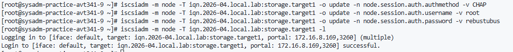

``` sudo iscsiadm -m session -o show ```

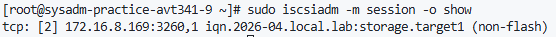

9) Проверим наличие блочных устройств по 512Мб

``` lsblk ```

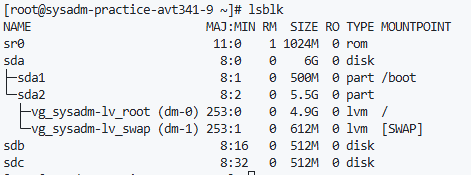

III) Проверить работоспособность iSCSI Target из п.3, в том числе после перезагрузки машины.

1) Перезагрузим машину 

``` sudo reboot ```

2) Убедимся что LUN активны:

``` sudo lvdisplay | grep -E "LV Name|LV Size" ```

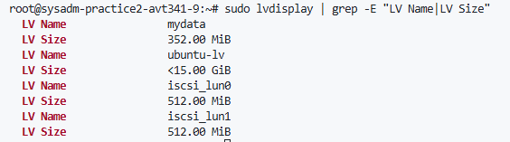

3) Проверим, что target активен
``` sudo systemctl status tgt ```

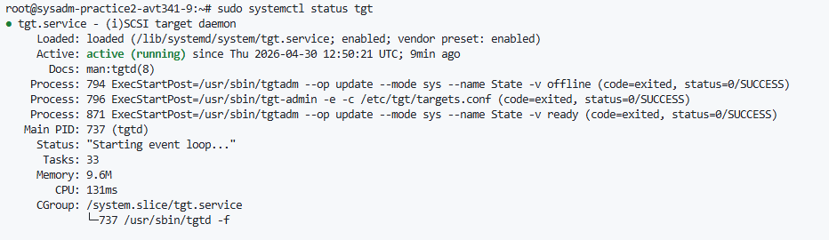

4) Просмотрим таргеты
``` tgtadm --mode target --op show ```

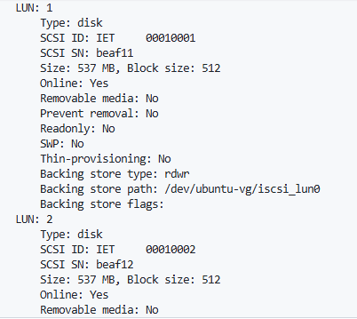

IV) Завершить процесс документирования, дополнить документацию необходимыми комментариями и подробным описанием всех встреченных в процессе сложностей. Допустимые форматы отчета: docx, pdf. Индивидуальный отчет после защиты загрузить в DiSpace3 (1 экземпляр от бригады).